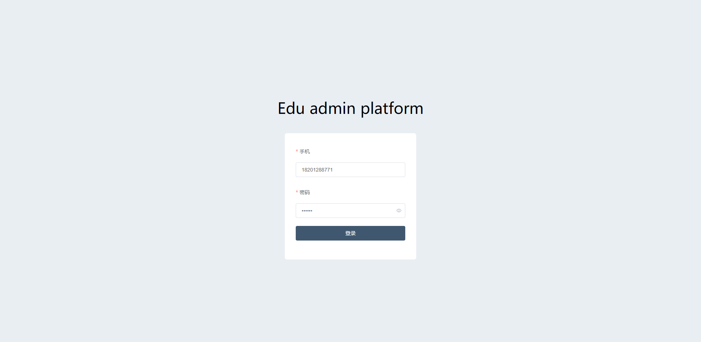
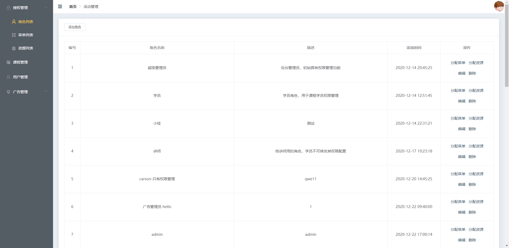
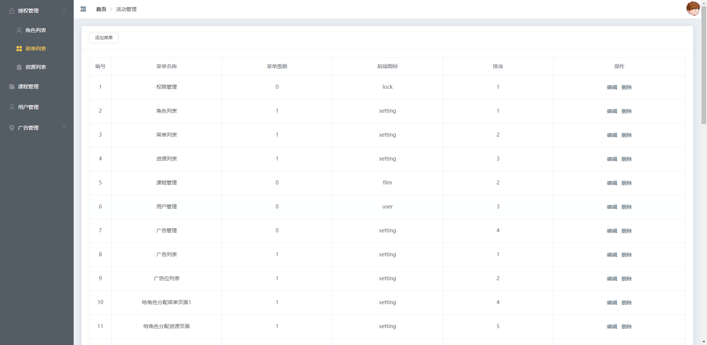
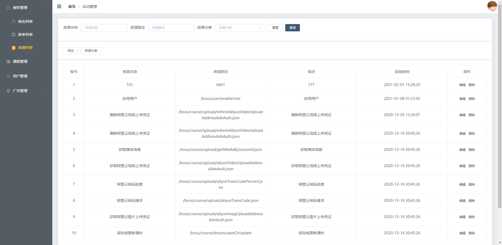
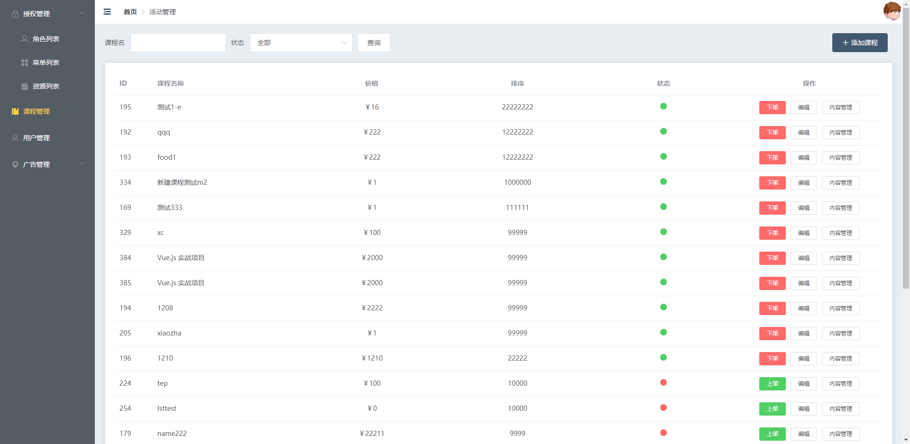
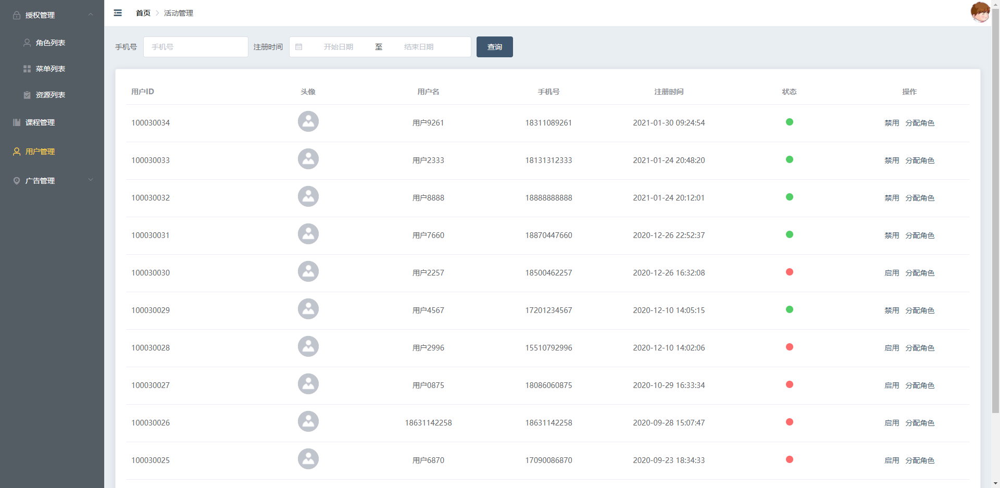
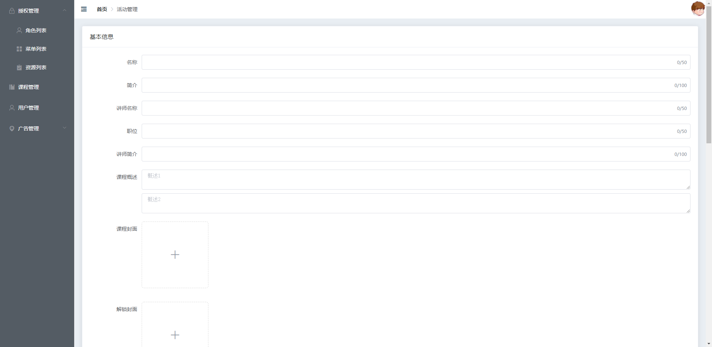
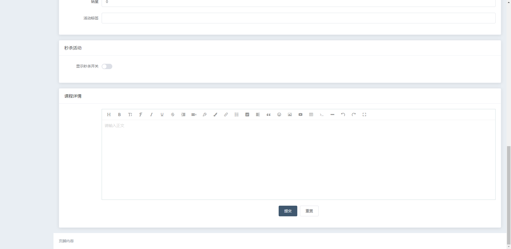

## 项目介绍
&#x2728;这是一个和教育相关的管理后台

## 技术栈
* Vue
* Vue-router
* Vuex
* Axios
* TypeScript
* Sass
* ElementUI
* Express

## 功能
&#x2705; 登录/登出
&#x2705; 角色管理
&#x2705; 菜单管理
&#x2705; 资源管理
&#x2705; 用户管理
&#x2705; 上传图片
&#x274C; 权限管理

## 接口地址
[edu-boss-boot](http://113.31.105.128/boss/doc.html#/home)  
[edu-front-boot](http://113.31.105.128/front/doc.html#/home)

## 账号密码
18201288771  
111111

## 安装运行
```js
// 安装依赖包
yarn install

// 运行项目
yarn run serve

// 打包项目
yarn run build

// 本地启动 node 服务器
yarn run dev
```

## Demo 界面















